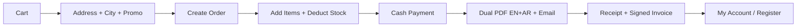

# Hayah — Project Analysis

**Date:** June 4, 2026  
**Last updated:** June 2026 (Sprints 1–5 + Tasks 1–7 implemented)  
**Stack:** Laravel 10, Jetstream/Fortify, Livewire 3, Blade, Bootstrap 5, DomPDF  
**Type:** Bilingual (EN/AR) fashion e-commerce with admin panel, customer account hub, and cash-on-delivery checkout

**Status legend:** ✅ Done · ⬜ Not done · ⚠️ Partial · ⏸️ Deferred (optional)

**Related docs:** [docs/storefront-redesign.md](docs/storefront-redesign.md) · [docs/user-panel-redesign.md](docs/user-panel-redesign.md) · [docs/user-panel-redesign-checklist.md](docs/user-panel-redesign-checklist.md)

---

## Executive summary

**Hayah** is a full-stack online store: unified storefront shell, product catalog with filters/sort, session/DB cart, guest and authenticated checkout, promo codes, city-based delivery fees, PDF invoices (EN + AR), email notifications, **customer My Account hub**, CRM-style admin customer profiles, and a full admin back office.

**Sprints 1–4 complete** — P0/P1 bugs fixed; **Tasks 1–5** (branding, SEO, analytics, guides, PDF) implemented.  
**Sprint 5 complete** — **Task 6** (storefront redesign) + **Task 7** (user panel + admin CRM polish).

Still open: full domain migrations from SQL dump, payment gateway, promo usage DB tracking, analytics P2 charts, wishlist/API.

Use the priority sections at the end to plan remaining work.

### Fix progress at a glance

| Area | Done | Partial | Open |
|------|:----:|:-------:|:----:|
| P0 bugs (#1–8) | 8 | 0 | 0 |
| P1 bugs (#9–20) | 12 | 0 | 0 |
| P2 bugs (#21–32) | 11 | 0 | 1 (#32 empty method removed — N/A) |
| Sprint 1 | ✅ All | — | — |
| Sprint 2 | ✅ All | — | — |
| Sprint 4 (Tasks 1–5) | 5 | 0 | 0 |
| Sprint 5 (Tasks 6–7) | 2 | 0 | 0 |

---

## What the project does

| Area | Features |
|------|----------|
| **Storefront shell** | Single `x-web.layout`, promo bar, sticky navbar, search modal, account menu, theme toggle, RTL bootstrap, 4-column footer, admin-configurable social links |
| **Storefront pages** | Home (hero, carousel, categories), PLP (filters, sort, chips, mobile drawer), PDP (gallery, sticky mobile CTA, breadcrumbs, related products, reviews), cart, checkout stepper, receipt + signed invoice download |
| **Cart** | Guest session cart + logged-in DB cart, merge on login, promo code (session), +/- qty, empty-state featured products |
| **Checkout** | Address form, saved-address picker (auth), city delivery fee, promo code, cash payment, receipt, dual EN/AR PDF + email |
| **My Account** | `/account` dashboard, orders + detail + stepper, addresses CRUD + default, profile + password, reviews list, invoice PDF |
| **Auth** | Jetstream registration/login; post-login HOME → `/account`; guest order merge on login; inactive user middleware |
| **Admin** | Dashboard, analytics, branding/SEO settings, admins, catalog, orders, CRM user/guest profiles, contacts, reviews, guides |
| **i18n** | `en` / `ar` via session locale; RTL layout on storefront and admin |

**Not implemented:** Online payment gateway, wishlist, mobile shop API, newsletter, FAQ page, contact map embed, promo per-code usage ledger in DB.

---

## Bugs

### P0 — Fix before production

| # | | Bug | Location | Impact |
|---|:--:|-----|----------|--------|
| 1 | ✅ | **Wrong controller class on route** — `UserController` does not exist; class is `userController` | `routes/web.php` | Fixed — uses `userController` |
| 2 | ✅ | **PSR-4 class name mismatch** — `shoppingCart` vs `ShoppingCart`, `products`, `productImages` | Controllers, `orders.php`, `AppServiceProvider`, `cart/index.blade.php` | Fixed — consistent lowercase model names |
| 3 | ✅ | **Promo code blocks all guests globally** | `app/Rules/ValidPromoCode.php` | Fixed — guests checked by **email**, not `user_id IS NULL` |
| 4 | ✅ | **Promo code / first order** — guest by email; logged-in by `user_id` (first order only) | `ValidPromoCode.php` | Fixed guest bug; auth behavior kept as first-order promo |
| 5 | ✅ | **Orphan orders on failed checkout** | `CheckoutController.php` | Fixed — `DB::transaction`, rollback on failure |
| 6 | ✅ | **Cart delete IDOR** | `CartController.php`, `routes/web.php` | Fixed — `DELETE /cart/{id}`, auth + `user_id` scope |
| 7 | ✅ | **Destructive actions via GET** | `routes/web.php` | Fixed — admin delete/status/toggle routes use POST + CSRF forms |
| 8 | ✅ | **Admin self-registration** | `routes/web.php`, `config/hayah.php` | Fixed — disabled unless `ALLOW_ADMIN_REGISTER=true` |

### P1 — Logic and data integrity

| # | | Bug | Location | Impact |
|---|:--:|-----|----------|--------|
| 9 | ✅ | **Order status casing inconsistent** | `CheckoutController`, `AdminController`, `orders` model | Fixed — checkout uses `Pending`; dashboard accepts `Completed` + `completed` |
| 10 | ✅ | **Guest cart delete key wrong** | `CartController`, `CheckoutController` | Fixed — `foreach ($combined as $key => $item)` |
| 11 | ✅ | **No empty-cart check before order** | `CheckoutController::order` | Fixed — redirects with message if cart empty |
| 12 | ✅ | **No stock re-check at checkout** | `orders.php` | Fixed — `lockForUpdate()` + quantity check before deduct |
| 13 | ✅ | **Guest cart wiped on login add** | `CartController.php` | Fixed — `mergeGuestCartIntoDatabase()` on login add |
| 14 | ✅ | **`updateOrCreate` with `id => ''`** for new orders | `CheckoutController.php` | Fixed — uses `orders::create()` / `addresses::updateOrCreate()` |
| 15 | ✅ | **`$request->all()` mass-assigned to address** | `CheckoutController.php` | Fixed — `addressPayload()` with allowed fields only |
| 16 | ✅ | **`country` in form but not in validation rules** | `CheckoutController` | Fixed — `country` in validation rules |
| 17 | ✅ | **`city` validated as string, used as numeric ID** | `CheckoutController.php` | Fixed — `exists:cities,id` |
| 18 | ✅ | **Inactive products still viewable by direct URL** | `ProductController::productWebShow` | Fixed — `is_active` + category/type checks |
| 19 | ✅ | **Duplicate route names** | `routes/web.php` | Fixed — duplicate `contact.send` removed; reviews route renamed |
| 20 | ✅ | **Hardcoded admin notification email** | Controllers + `config/hayah.php` | Fixed — `HAYAH_ADMIN_EMAIL` / `config('hayah.admin_email')` |

### P2 — Quality, display, typos

| # | | Bug | Location |
|---|:--:|-----|----------|
| 21 | ✅ | **Global view composer loads every active product on every view** | `AppServiceProvider.php` | Fixed — products only on `index`; nav data scoped |
| 22 | ✅ | **Catalog eager-loads `orderItems`, `shoppingCart`** unnecessarily | `ProductController::productWebList` | Fixed — removed unused relations |
| 23 | ✅ | **Admin order views use wrong relations** | `admin/user/show`, `admin/guest/show` | Fixed — `discountCodes`, `cities` |
| 24 | ✅ | **Operator precedence in unit price** | `admin/order/show.blade.php` | Fixed |
| 25 | ✅ | **Currency shows `$` instead of `LE`** | Admin user/guest show views | Fixed |
| 26 | ✅ | **Guest admin view may crash** if no address | `admin/guest/show.blade.php` | Fixed — null-safe address loop |
| 27 | ✅ | **Wrong relation in stock message** | `CartController.php` | Fixed — uses `products()` relation |
| 28 | ✅ | **Image validation uses `image` but upload uses `images`** | `ProductController.php` | Fixed |
| 29 | ✅ | **Typos** — `deleveryFees`, `assocatation` | Receipt, ProductController | Fixed — `deliveryFees`, `association` |
| 30 | ✅ | **Review admin search column mismatch** | `ReviewController.php` | Fixed — maps `comment` |
| 31 | ✅ | **Auth checkout summary ≠ charged total** | `checkout/address.blade.php` | Fixed — subtotal, delivery, discount, total + JS |
| 32 | ✅ | **Dead code / imports** | Various | Fixed — removed empty `addOrderItem` method |

---

## Flows to enhance

### Checkout flow



**Current problems:** None remaining in this section.

**Recommended changes:**

1. ✅ Single **DB transaction**: order → items → payment; rollback on failure (emails after commit).
2. ✅ **Validate cart non-empty** + **re-validate stock** at checkout (`lockForUpdate`).
3. ✅ **Full breakdown** on checkout (line items, delivery, discount, total).
4. ✅ **Normalize order status** — checkout uses `Pending`; admin validates allowed statuses.
5. ✅ **Promo eligibility** — first order per user/email (guest global bug fixed).
6. ✅ **Checkout token** — duplicate-submit protection via `checkout_token` session.

### Cart flow

- ✅ **Merge** session cart into DB when user logs in (on add-to-cart).
- ✅ Fix guest item **`key`** when building cart rows for delete URLs.
- ✅ Use **POST/DELETE** for remove with ownership check.
- ✅ **Quantity update** — POST routes + forms on cart page.

### Auth flow

- Checkout and cart are intentionally public; only **reviews** require `verified` + `active.user`.
- Document that **inactive users** are blocked globally via `EnsureUserIsActive` middleware.

### Admin & orders flow

- ✅ Remove or restrict **admin register** — env `ALLOW_ADMIN_REGISTER`.
- ✅ Replace GET deletes — cart + admin routes use POST with CSRF.
- ✅ **Validate** `changeOrderStatus` against allowed statuses.
- ⬜ Payments **cash-only** — no reconciliation workflow (by design for now).
- ✅ Auth checkout sets **`address_id`** on order record.

### Payments flow

- No online gateway, webhooks, or refund flow.
- Plan integration (e.g. Paymob, Fawry, Stripe) if moving beyond COD.

---

## UI bugs

| # | | Issue | File | Notes |
|---|:--:|-------|------|-------|
| 1 | ✅ | **Invalid HTML structure** — Checkout form spans two columns | `checkout/address.blade.php` | Fixed — single form wraps both columns |
| 2 | ✅ | **Checkout summary has no line items** | `checkout/address.blade.php` | Fixed — product lines in summary |
| 3 | ✅ | **`instanceof shoppingCart` fails on Linux** | `cart/index.blade.php` | Fixed — correct model class name |
| 4 | ✅ | **Guest cart images N+1** | `cart/index.blade.php` | Fixed — `whereIn` eager load |
| 5 | ✅ | **Admin register `@error('name')` vs `username`** | `admin/register.blade.php` | Fixed |
| 6 | ✅ | **Admin user breadcrumb links to `/`** | `admin/user/show.blade.php` | Fixed — `admin.dashboard` |
| 7 | ✅ | **Product page hardcoded `/login`** | `product/show.blade.php` | Fixed — `route('login')` |
| 8 | ✅ | **Duplicate URLs** `/checkout` and `/checkout/address` | `routes/web.php` | Fixed — `/checkout/address` redirects to `/checkout` |
| 9 | ✅ | **RTL/LTR** admin tables in Arabic | Admin Blade + `style-Dashboard.css` | Mobile action column + sidebar backdrop fixed |
| 10 | ✅ | **Mobile** cart/checkout/PLP layout | Storefront views | Stepper, sticky summary, filter drawer, PDP sticky CTA |

---

## Features to add

| Priority | Feature | Why |
|----------|---------|-----|
| **P0** | **Domain migrations + seeders** | Only Jetstream migrations exist; schema relies on SQL dump |
| **P0** | **E-commerce test suite** | Cart, checkout, promo, stock, admin order status — zero coverage today |
| **P1** | ✅ **Customer order history** | `/account/orders`, order detail, invoice — storefront My Account hub |
| **P1** | **Payment gateway** | Cash-only limits automation and trust |
| **P1** | ✅ **Cart merge on login** | Implemented in `CartController::mergeGuestCartIntoDatabase()` |
| **P1** | ✅ **Inventory locking** | `lockForUpdate()` + stock check at checkout |
| **P1** | ⬜ **Promo usage tracking** | Per-code / per-email limits in DB |
| **P1** | ✅ **Configurable admin email** | `config/hayah.php` + `HAYAH_ADMIN_EMAIL` |
| **P1** | ✅ **Remove or scope global product view composer** | Products only on `index`; nav scoped |
| **P2** | **Admin RBAC** | Roles (catalog vs orders vs super-admin) |
| **P2** | **Wishlist / favorites** | Common for fashion |
| **P2** | ✅ **Rate limiting** | Contact + checkout throttled (10/min) |
| **P2** | **REST/API for mobile** | `api.php` has only Sanctum `/user` |
| **P2** | **Order tracking page** | Public link with token for guests |
| **P2** | **Abandoned cart emails** | Recovery for guest/session carts |

> **New planned work** — See **[Planned feature tasks](#planned-feature-tasks)** below for: generic branding/assets, configurable SEO, business analytics, downloadable guided PDF, and **enhanced PDF design with admin-managed logo** (Task 5).

---

## Planned feature tasks

Use this section as the implementation backlog. Tell the developer: *“Do task 1”*, *“Do task 3.2”*, etc.

**Status legend:** ✅ / `[x]` done · ⬜ / `[ ]` not started · `[~]` in progress

---

### Task 1 — Generic branding & static assets

**Goal:** Logo, favicon, hero images, placeholders, and other static visuals are **not hardcoded to Hayah**. Any store/tenant can swap them from admin or config without editing Blade files.

| ID | Subtask | Status | Notes |
|----|---------|--------|-------|
| 1.1 | **Site settings model/table** — `site_settings` | ✅ | Migration `2026_06_04_000001_create_site_settings_table.php` |
| 1.2 | **Admin UI: Branding / Media** — upload logo, favicon, OG image, placeholders | ✅ | `admin/settings/branding` + `SiteSettingsController` |
| 1.3 | **Replace hardcoded image paths in views** | ✅ | Web/admin/auth components, index, cart, product, PDF |
| 1.4 | **Generic placeholders** — product-no-image | ✅ | `x-branding.product-image` + admin upload |
| 1.5 | **`.env` / config fallbacks** | ✅ | `config/branding.php` + `.env.example` `BRAND_*` vars |
| 1.6 | **Cache-bust URLs** — `?v=timestamp` on asset URLs | ✅ | `BrandingService::versionQuery()` |
| 1.7 | **Bilingual alt text** — `logo_alt_en`, `logo_alt_ar` | ✅ | Admin form + `logoAlt()` |
| 1.8 | **`BrandingService`** — shared via `View::share('branding')` | ✅ | `app/Services/BrandingService.php` |
| 1.9 | **PDF logo filesystem path for DomPDF** | ✅ | `logoPath()` used in `pdf/invoice.blade.php` |
| 1.10 | **Social media URLs** — Instagram, Facebook, TikTok, YouTube, WhatsApp, X | ✅ | Migration `000011`; `x-web.social-links` |
| 1.11 | **Homepage hero/category images** | ✅ | `hero_image_path`, `category_image_*` in branding admin |

**Acceptance criteria**

- [x] ✅ Admin can change logo and favicon; change appears on storefront and admin without code deploy.
- [x] ✅ Views use `$branding` / components — defaults from `config/branding.php` if DB empty.
- [x] ✅ Order invoice PDF loads logo from settings (or site name fallback).

**Likely files:** new `SiteSettingsController`, migration, `resources/views/admin/settings/branding.blade.php`, `AppServiceProvider` or view composer for `$branding`, `app/Services/BrandingService.php`.

---

### Task 2 — Generic, editable SEO

**Goal:** SEO is **centralized and editable** (admin + per-page overrides), not scattered hardcoded `<title>` / meta tags. Works for EN and AR.

| ID | Subtask | Status | Notes |
|----|---------|--------|-------|
| 2.1 | **Global SEO settings** — default title template, meta description, keywords, OG title/description/image, Twitter card, `robots`, canonical base URL | ✅ | `admin/settings/seo` — `SiteSeoController` |
| 2.2 | **Per-entity SEO** — products, categories, types: `meta_title`, `meta_description`, `slug`, `og_image` (nullable → fallback) | ✅ | Product admin fields; migrations on catalog tables |
| 2.3 | **Per-page SEO** — home, contact, legal, cart, checkout: editable in admin or `pages` table | ✅ | `seo_pages` + seeder |
| 2.4 | **Blade component `<x-seo.meta />`** — reads global + page + entity context | ✅ | `SeoService` + `components/seo/meta.blade.php` |
| 2.5 | **hreflang** — `en` / `ar` alternate links for bilingual URLs | ✅ | In `<x-seo.meta />` |
| 2.6 | **Sitemap** — `/sitemap.xml` (products, categories, static pages; respect `is_active` / `is_indexable`) | ✅ | `SeoPublicController@sitemap` |
| 2.7 | **Structured data (JSON-LD)** — `Product`, `Organization`, `BreadcrumbList` on product and layout | ✅ | Product + Organization (BreadcrumbList P2) |
| 2.8 | **robots.txt** — dynamic or configurable disallow (admin, cart, checkout) | ✅ | `GET /robots.txt` |
| 2.9 | **SEO preview in admin** — show Google/social snippet preview when editing product/page | `[ ]` | Optional P2 polish |

**Acceptance criteria**

- ✅ Merchant can change site-wide meta without touching code.
- ✅ Each product can have unique title/description; inactive products excluded from sitemap.
- ✅ Home and legal pages have editable meta in EN and AR.

**Likely files:** `SiteSeoController`, `resources/views/components/seo/meta.blade.php`, migrations, `routes/web.php` sitemap route.

---

### Task 3 — Business analytics & decision dashboard

**Goal:** Admin gets **actionable analytics** for merchandising and marketing: what is viewed, who is on the site now, and trends from **1 day → 1 year+** (and custom ranges).

#### 3.A — Data collection (foundation)

| ID | Subtask | Status | Notes |
|----|---------|--------|-------|
| 3.1 | **`product_views` table** — `product_id`, `user_id` (nullable), `session_id`, `ip_hash`, `user_agent`, `referrer`, `locale`, `viewed_at` | ✅ | `ProductController` + 30 min throttle |
| 3.2 | **`page_views` table** — optional for home, category list, checkout funnel | ✅ | `TrackAnalytics` middleware |
| 3.3 | **`active_sessions` / presence** — heartbeat endpoint or middleware ping every N seconds | ✅ | `visitor_presence` via middleware |
| 3.4 | **Guest vs logged-in** — flag on events; link to `users` / `guest_users` when known | ✅ | `user_id` on events; IP hashed |
| 3.5 | **Order/cart aggregates** — reuse `orders`, `order_items` for revenue metrics (no duplicate order DB) | ✅ | Sales tab uses `orders` |

#### 3.B — Reports & time ranges

| ID | Subtask | Status | Notes |
|----|---------|--------|-------|
| 3.6 | **Date range picker** — presets: Today, Yesterday, Last 7/30 days, This month, Last month, This year, Last year, **Custom range**, All time | ✅ | `AnalyticsController` |
| 3.7 | **Most viewed products** — table + chart; top N; compare previous period (% change) | ✅ | Table + uniques; % change P2 |
| 3.8 | **Product detail over time** — per product: views / add-to-cart / orders / conversion rate | ✅ | Daily table from `analytics_daily`; cart/conv P2 |
| 3.9 | **Category & type performance** — views and revenue by category/type | `[ ]` | P2 |
| 3.10 | **Live visitors panel** — count + optional list: page, product, country/city (if GeoIP), guest/auth, time on site | ✅ | Poll every 45s; GeoIP P2 |
| 3.11 | **Traffic overview** — sessions, page views, bounce proxy, peak hours heatmap | `[ ]` | KPI cards only; heatmap P2 |
| 3.12 | **Sales analytics** — revenue, orders count, AOV, completed vs pending, by city, by promo code | ✅ | Sales tab (city/promo P2) |
| 3.13 | **Inventory signals** — low stock, high views/low sales (“window shoppers”), dead stock | `[ ]` | P2 |
| 3.14 | **Export** — CSV/Excel for product views and sales for selected range | ✅ | CSV export route |
| 3.15 | **Optional: chart library** — Chart.js or ApexCharts in admin | `[ ]` | P2 |

#### 3.C — Admin UI

| ID | Subtask | Status | Notes |
|----|---------|--------|-------|
| 3.16 | **New admin section: Analytics** — sidebar link, permission-ready | ✅ | `admin/analytics` tabs |
| 3.17 | **Overview dashboard** — KPI cards + charts for selected range | ✅ | KPI cards; charts P2 |
| 3.18 | **Retention / returning visitors** — % returning session_ids or users (7d/30d) | `[ ]` | P2 |
| 3.19 | **Scheduled aggregation** — nightly job rolls raw events into `analytics_daily` (product_id, date, views, orders, revenue) | ✅ | `analytics:aggregate` daily 02:00 |
| 3.20 | **Data retention policy** — raw events 90 days; aggregates keep 2+ years | `[ ]` | Config in `config/analytics.php`; purge job P2 |

**Acceptance criteria**

- ✅ Admin sees “**X visitors live now**” updated without full page reload.
- ✅ Admin sees **top products by views** for at least: today, last 30 days, last year, custom range.
- ✅ Per-product report shows trend line or table by day/month for chosen range (1 day granularity near today; monthly for 1 year+).
- ✅ Sales and views can be compared in one screen to support stocking and promo decisions.

**Likely files:** `AnalyticsController`, models `ProductView`, `AnalyticsDaily`, jobs `AggregateAnalyticsJob`, `resources/views/admin/analytics/*`, middleware or JS heartbeat on layout.

**Out of scope (unless requested later):** Full Google Analytics replacement, ML forecasting, A/B testing.

---

### Task 4 — Guided PDF (user-downloadable)

**Goal:** Users can **download a guided PDF** from the site (e.g. size guide, care instructions, how to order, brand story)—content manageable by admin, not a fixed file in `public/`.

| ID | Subtask | Status | Notes |
|----|---------|--------|-------|
| 4.1 | **`guides` or `downloadable_documents` table** — `title_en`, `title_ar`, `description_*`, `file_path` OR `html_content_*`, `sort_order`, `is_active`, `published_at` | ✅ | Migration `000006_create_guides_and_pdf_settings` |
| 4.2 | **Admin CRUD: Guides / PDFs** — upload PDF, or WYSIWYG/simple editor for HTML → PDF | ✅ | `AdminGuideController` + `admin/guides/*` |
| 4.3 | **Storefront: Guides page** — `/guides` lists active guides with title, short description, download button | ✅ | `guides/index.blade.php` + SEO page key |
| 4.4 | **Download route** — `GET /guides/{slug}/download` — auth optional (configurable public vs login-only) | ✅ | `requires_auth` per guide; analytics `guide_download` |
| 4.5 | **Navbar/footer link** — “Help & guides” | ⚠️ | Footer + product guide links; guides hidden from main nav (by product decision) |
| 4.6 | **Multiple guides** — size chart, return policy PDF, fabric care, measurement how-to | ✅ | Unlimited via admin list |
| 4.7 | **Use shared PDF layout** — extend `pdf/layout.blade.php` from Task 5 (logo, footer, typography) | ✅ | `pdf/guide.blade.php` extends layout |
| 4.8 | **Optional: attach guide to product** — `product.guide_id` or pivot “related guides” on product page | ✅ | `products.guide_id` + product show link |

**Acceptance criteria**

- ✅ Admin uploads or publishes a guide; it appears on `/guides` in EN and AR.
- ✅ Visitor clicks **Download** and receives the correct PDF.
- ✅ Guide PDFs **inherit logo and brand styling** from Task 1 + Task 5 layout—no duplicate templates.

**Likely files:** `GuideController`, model `Guide`, views `resources/views/guides/*`, `admin/guides/*`, reuse `Barryvdh\DomPDF` + Task 5 layouts.

**Note:** Marketing/help guides (Task 4) share the same PDF design system as order invoices (Task 5)—different content, one layout.

---

### Task 5 — PDF design enhancement & admin logo inheritance

**Goal:** Replace the basic invoice PDF (`resources/views/pdf/invoice.blade.php` — plain Arial, no logo, generic grey tables) with a **professional, on-brand document**. Every generated PDF **inherits the admin-managed logo** and site identity from Task 1—never a static file path in Git.

**Current state (to replace):**

- Invoice generated in `App\Traits\Apptraits::generatePdfInvoice()` → `Pdf::loadView('pdf.invoice', ...)`
- No logo, no brand colors, weak line-item pricing display, English-only labels
- Attached to order emails as `invoice.pdf`

#### 5.A — Shared PDF layout (all PDF types)

| ID | Subtask | Status | Notes |
|----|---------|--------|-------|
| 5.1 | **Base layout** — `resources/views/pdf/layout.blade.php` | ✅ | DomPDF-safe tables/CSS |
| 5.2 | **Logo in header** — `` from `BrandingService` | ✅ | Absolute path via `BrandingService::logoPath()` |
| 5.3 | **Brand block** — site name, tagline, support email, phone, website URL from settings | ✅ | `PdfService::brandingContext()` |
| 5.4 | **Configurable colors** — `primary_color`, `accent_color` in branding settings | ✅ | Branding admin + `accent_color` column |
| 5.5 | **Footer on every page** — site URL, thank-you line, optional legal line, **page X of Y** | ✅ | Fixed footer block (page X/Y P2) |
| 5.6 | **RTL-ready CSS** — when order/guide locale is `ar`, mirror text alignment and table direction | ✅ | `dir` + `align` in branding context |
| 5.7 | **Shared partials** — `pdf/partials/header.blade.php`, `footer.blade.php`, `styles.blade.php` | ✅ | Shared across invoice + guide |

#### 5.B — Order invoice PDF (redesign)

| ID | Subtask | Status | Notes |
|----|---------|--------|-------|
| 5.8 | **Refactor** `pdf/invoice.blade.php` → extends `pdf.layout` | ✅ | Via `PdfService` |
| 5.9 | **Invoice header block** — “Invoice / فاتورة”, order #, date, status badge styling | ✅ | `resources/lang/*/pdf.php` |
| 5.10 | **Customer & shipping block** — two-column card: name, email, phone, address, city, delivery fee | ✅ | Bill to / ship to cards |
| 5.11 | **Line items table** — product image thumb (optional), name, size, qty, **unit price**, line total | ✅ | Unit = `order_items.price / qty` |
| 5.12 | **Totals summary** — subtotal, discount (code + %), delivery, **grand total** in LE | ✅ | Summary table |
| 5.13 | **Payment section** — method (Cash), amount, status, date — compact row | ✅ | Only if payments exist |
| 5.14 | **Typography & spacing** — consistent font sizes (10–12pt body, 16–18pt titles), row zebra striping | ✅ | Zebra rows + margins in styles |
| 5.15 | **Pass branding into `generatePdfInvoice()`** | ✅ | `PdfService::saveInvoice()` |

#### 5.C — Guided PDFs & admin (Task 4 integration)

| ID | Subtask | Status | Notes |
|----|---------|--------|-------|
| 5.16 | **Guide PDF view** — `pdf/guide.blade.php` extends same layout | ✅ | HTML → PDF or uploaded file |
| 5.17 | **Admin “Preview PDF”** on branding/guides screens | ✅ | `admin/settings/pdf-preview` |
| 5.18 | **Admin reprint invoice** — download PDF from order detail page | ✅ | `order.invoice` route on order show |

#### 5.D — Technical (DomPDF)

| ID | Subtask | Status | Notes |
|----|---------|--------|-------|
| 5.19 | **Enable remote/local images** in `config/dompdf.php` if needed | ✅ | `config/dompdf.php` with chroot |
| 5.20 | **Logo constraints** — max width 180px, max height 60px in header; maintain aspect ratio | ✅ | `config/pdf.php` + CSS |
| 5.21 | **Cache bust** — regenerate PDFs do not embed stale logo after admin upload | ✅ | Logo read at generation time |
| 5.22 | **Optional: PDF settings in admin** — footer text EN/AR, invoice thank-you message | ✅ | Branding → PDF settings section |

**Design spec (visual target)**

```
┌─────────────────────────────────────────────┐
│  [LOGO from admin]     Site Name            │
│                        tagline / contact    │
├─────────────────────────────────────────────┤
│  INVOICE #12345          Date: 2026-06-04   │
├─────────────────────────────────────────────┤
│  Bill to          │  Ship to                 │
│  name, email      │  address, city, phone    │
├─────────────────────────────────────────────┤
│  # │ Product │ Size │ Qty │ Unit │ Total    │
│  ──┼─────────┼──────┼─────┼──────┼────────  │
│  1 │ ...     │  M   │  2  │  ... │  ... LE  │
├─────────────────────────────────────────────┤
│                    Subtotal:      xxx LE    │
│                    Discount:       -xx LE   │
│                    Delivery:        xx LE   │
│                    TOTAL:         xxxx LE   │
├─────────────────────────────────────────────┤
│  Thank you — configurable message           │
│  www.site.com              Page 1 of 1      │
└─────────────────────────────────────────────┘
```

**Acceptance criteria**

- ✅ Admin uploads a new logo in Branding → next order invoice PDF shows **new logo** without code change.
- ✅ Invoice PDF looks **modern and readable** (not plain unstyled HTML tables).
- ✅ Guided PDF downloads use the **same header/footer/logo** as invoices.
- ✅ If logo is missing, PDF still generates with site name text fallback (no broken image icon).
- ✅ Arabic invoice/guide renders RTL layout correctly.

**Likely files (verification):**

| File | Status |
|------|--------|
| `resources/views/pdf/layout.blade.php` | ✅ |
| `resources/views/pdf/invoice.blade.php` | ✅ extends layout |
| `resources/views/pdf/guide.blade.php` | ✅ |
| `resources/views/pdf/partials/header.blade.php` | ✅ |
| `resources/views/pdf/partials/footer.blade.php` | ✅ |
| `resources/views/pdf/partials/styles.blade.php` | ✅ |
| `app/Services/BrandingService.php` | ✅ `logoPath()` for DomPDF |
| `app/Services/PdfService.php` | ✅ invoice + guide generation |
| `app/Traits/Apptraits.php` | ✅ delegates to `PdfService::saveInvoice()` |
| `resources/lang/en/pdf.php`, `resources/lang/ar/pdf.php` | ✅ |
| `config/dompdf.php`, `config/pdf.php` | ✅ |

**Depends on:** Task 1 ✅ shipped. Run `php artisan test --filter=ImplementationFiles` to re-verify paths.

**Post–Task 5 enhancements (Sprint 5):**

| Enhancement | Status | Notes |
|-------------|--------|-------|
| Dual invoice PDF (EN + AR) in order emails | ✅ | `PdfService::saveInvoices()` → `invoice_{id}_en.pdf` + `_ar.pdf` |
| Plain-text invoice notes in admin | ✅ | Branding form textareas; strip HTML on save |
| Signed receipt invoice download (guests) | ✅ | `checkout.receipt.invoice` (48h signed URL) |

---

### Task 6 — Storefront redesign & unified shell

**Goal:** One valid HTML document, shared design tokens, complete shop journey (home → PLP → PDP → cart → checkout → receipt), mobile-first UX.

**Doc:** [docs/storefront-redesign.md](docs/storefront-redesign.md) — **✅ Implemented**

| ID | Subtask | Status | Notes |
|----|---------|--------|-------|
| 6.1 | **`x-web.layout`** — single shell for all shop pages | ✅ | `components/web/layout.blade.php` |
| 6.2 | **Deprecate duplicate HTML** — navbar/header/sidebar stubs | ✅ | No nested `<html>` documents |
| 6.3 | **Design tokens** — `storefront-shell.css` + dark mode theme | ✅ | Cairo + El Messiri; removed global `box-shadow: none` conflict |
| 6.4 | **RTL bootstrap** when `dir="rtl"` | ✅ | Layout + PLP filter offcanvas |
| 6.5 | **`x-web.product-card`** — shared grid card + hover bag link | ✅ | Home, PLP, cart empty, related products |
| 6.6 | **`x-web.checkout-stepper`** + **`x-web.breadcrumb`** | ✅ | Cart + checkout + PLP/PDP |
| 6.7 | **Navbar account** — login icon + auth dropdown + mobile links | ✅ | Orders, profile, logout |
| 6.8 | **Footer 4 columns** — shop, help, legal, social | ✅ | Guides in help; cookies in legal |
| 6.9 | **Generic social links** — admin branding URLs | ✅ | `x-web.social-links`, migration `000011` |
| 6.10 | **PLP** — filters, on-sale, sort, chips, empty state, 4-col grid | ✅ | `product/list.blade.php` |
| 6.11 | **PDP** — sticky mobile CTA, related products, review average | ✅ | `product/show.blade.php` |
| 6.12 | **Cart** — promo field, +/- qty, guest hint, featured empty state | ✅ | `cart.promo` route |
| 6.13 | **Checkout** — saved addresses, create-account checkbox | ✅ | `checkout/address.blade.php` |
| 6.14 | **Receipt** — white confirmation card + invoice + email note | ✅ | `checkout/receipt.blade.php` |
| 6.15 | **Legal** — sticky in-page nav + cookies section | ✅ | `legal.blade.php` |
| 6.16 | Optional: FAQ, newsletter, contact map, review pagination | ⏸️ | Deferred — see storefront doc |

**Acceptance criteria**

- [x] ✅ All shop pages use `x-web.layout` with valid HTML.
- [x] ✅ Product card and tokens consistent across home, PLP, and cart.
- [x] ✅ Mobile checklist (sticky header, PDP CTA, filter drawer, RTL) complete.

**Key files:** `components/web/*`, `public/assets/css/storefront-shell.css`, `storefront-theme.css`, `assets/css/plp.css`, `assets/css/account.css`

---

### Task 7 — User panel (My Account + admin CRM)

**Goal:** Customer-facing account hub integrated with storefront; admin user/guest management as CRM-style profiles.

**Docs:** [docs/user-panel-redesign.md](docs/user-panel-redesign.md) · [docs/user-panel-redesign-checklist.md](docs/user-panel-redesign-checklist.md) — **✅ Implemented**

#### 7.A — Customer My Account

| ID | Subtask | Status | Notes |
|----|---------|--------|-------|
| 7.1 | **Routes** `/account/*` | ✅ | Dashboard, orders, addresses, profile, reviews |
| 7.2 | **Layout + sidebar** | ✅ | `x-account.layout`, `x-account.sidebar` inside `x-web.layout` |
| 7.3 | **Order list + detail + stepper** | ✅ | `x-account.order-stepper`, status pills |
| 7.4 | **Invoice download** (own orders only) | ✅ | `account.orders.invoice` |
| 7.5 | **Addresses CRUD + default** | ✅ | Migration `000010`, `is_default` |
| 7.6 | **Profile + password** (storefront styled) | ✅ | Phone field; Jetstream redirect to `/account/profile` |
| 7.7 | **Reviews list** | ✅ | `account/reviews.blade.php` |
| 7.8 | **Guest → account merge** | ✅ | `GuestAccountMergeService`, `MergeGuestOrdersOnLogin` |
| 7.9 | **Receipt + checkout CTAs** | ✅ | View in account; guest register prompt |
| 7.10 | **Post-login HOME** | ✅ | `RouteServiceProvider::HOME = '/account'` |

#### 7.B — Admin CRM

| ID | Subtask | Status | Notes |
|----|---------|--------|-------|
| 7.11 | **User list filters** — search, status, has orders, new | ✅ | `admin/user/list.blade.php` |
| 7.12 | **Guest list mirror** | ✅ | `admin/guest/list.blade.php` |
| 7.13 | **Shared CRM profile** | ✅ | `AdminCustomerProfileService` + `x-admin.customer-profile` |
| 7.14 | **KPI strip, orders table, address cards** | ✅ | Registered vs guest badges |
| 7.15 | **Quick actions** — toggle active, email, latest order | ✅ | Profile header |
| 7.16 | **Consistent View links** | ✅ | `x-admin.view-link` in tables + profile |
| 7.17 | **Mobile admin table actions** | ✅ | CSS + sidebar backdrop on small screens |
| 7.18 | Admin user list **date range** filter | ⏸️ | Optional — not implemented |

**Acceptance criteria**

- [x] ✅ Logged-in customer can view orders, download invoice, manage addresses/profile from storefront.
- [x] ✅ Admin user and guest detail pages share one CRM layout.
- [x] ✅ Navbar links to account; guest checkout can merge orders after login/register.

**Key files:** `AccountController.php`, `resources/views/account/*`, `AdminCustomerProfileService.php`, `components/admin/customer-profile.blade.php`

---

## Feature implementation order (recommended)

| Order | Task | Status |
|-------|------|--------|
| 1 | **Task 1** — Generic branding | ✅ Complete |
| 2 | **Task 5** — PDF design + logo inheritance | ✅ Complete |
| 3 | **Task 2** — Generic SEO | ✅ Complete (2.9 preview = P2) |
| 4 | **Task 3** — Analytics | ✅ Core complete (charts/retention = P2) |
| 5 | **Task 4** — Guided PDF | ✅ Complete |
| 6 | **Task 6** — Storefront redesign | ✅ Complete |
| 7 | **Task 7** — User panel + admin CRM | ✅ Complete |

**Note:** Task 5 upgraded the order invoice; Task 4 guides share the same `pdf/layout.blade.php` design system. Task 6 + 7 integrate the shop with My Account and admin CRM.

---

## Security checklist

- [x] ✅ Replace GET deletes for **cart** with POST/DELETE + CSRF  
- [x] ✅ Replace GET deletes for **admin** with POST/DELETE + CSRF  
- [x] ✅ Authorize cart row deletion by `user_id`  
- [x] ✅ Lock down `admin/register` (env flag)  
- [x] ✅ Throttle `checkout/order` and `contact/send` (10/min)  
- [x] ✅ Avoid exposing raw exception messages in JSON cart responses (`CartController`)  
- [x] ✅ `.env` in `.gitignore`; root `*.sql` dumps ignored (`u242664788_e_commerce*.sql`) — do not force-add  

---

## Testing gap

**Added:**

- `tests/Feature/ImplementationFilesTest.php` — asserts all Task 1–5 files exist + key routes registered
- `tests/Unit/PdfServiceTotalsTest.php` — invoice subtotal/discount math

**Still missing (need full DB schema / factories):**

- `CartController` (add, delete, guest vs auth, stock limits)
- `CheckoutController` (empty cart, promo, totals, rollback)
- `ValidPromoCode` (guest, returning customer, expired code)
- `orders::addOrderItems` (stock deduction)
- Admin order status changes and revenue filters

Run: `php artisan test --filter=ImplementationFiles`

---

## Suggested fix order

### Sprint 1 (P0) — ✅ Complete

1. ✅ Fix `UserController` → `userController` in `routes/web.php`.  
2. ✅ Rename usages to `shoppingCart` / `products` / `productImages` consistently (PHP + Blade).  
3. ✅ Fix `ValidPromoCode` guest and first-order logic.  
4. ✅ Wrap checkout in a transaction; guard empty cart; no orphan orders.  
5. ✅ Secure cart delete (auth + ownership, DELETE + POST forms).  
6. ✅ Disable or restrict admin self-registration.

### Sprint 2 (P1) — ✅ Complete

All items implemented including checkout UI totals, stock lock at checkout, admin POST deletes, cart quantity update, and checkout duplicate-submit token.

### Sprint 3 (P2 + stability) — ⚠️ Partial

| Item | Status |
|------|--------|
| View composer performance | ✅ |
| Admin relation fixes | ✅ |
| Task migrations (`2026_06_04_*`) | ✅ 11 files; full catalog still needs SQL dump or domain seeders |
| Smoke tests | ✅ `ImplementationFilesTest` |
| Payment gateway | ⬜ Not started |
| Customer order history page | ✅ Task 7 — `/account/orders` |

### Sprint 4 (Tasks 1–5) — ✅ Complete

1. ✅ **Task 1** — Branding  
2. ✅ **Task 5** — PDF design  
3. ✅ **Task 2** — SEO  
4. ✅ **Task 3** — Analytics  
5. ✅ **Task 4** — Guided PDFs  

### Sprint 5 (Tasks 6–7) — ✅ Complete

1. ✅ **Task 6** — Storefront redesign (layout, PLP, PDP, cart, checkout, receipt, footer, social)  
2. ✅ **Task 7** — User panel (My Account hub, guest merge, admin CRM profiles, mobile admin tables)  

**Post-sprint polish:** Run `php artisan migrate --force` for migrations `000010` (phone, default address) and `000011` (social URLs) if not applied.

---

## Key files reference

| Purpose | Path |
|---------|------|
| Routes | `routes/web.php` |
| Checkout | `app/Http/Controllers/CheckoutController.php` |
| Cart | `app/Http/Controllers/CartController.php` |
| Account | `app/Http/Controllers/AccountController.php` |
| Promo rule | `app/Rules/ValidPromoCode.php` |
| Order logic | `app/Models/orders.php` |
| Guest merge | `app/Services/GuestAccountMergeService.php`, `app/Listeners/MergeGuestOrdersOnLogin.php` |
| Admin CRM | `app/Services/AdminCustomerProfileService.php` |
| Global view data | `app/Providers/AppServiceProvider.php` |
| Branding | `app/Services/BrandingService.php`, `admin/settings/branding` |
| SEO | `app/Services/SeoService.php`, `SiteSeoController`, `components/seo/meta` |
| Analytics | `app/Services/AnalyticsService.php`, `admin/analytics/` |
| Guides | `GuideController`, `AdminGuideController`, `resources/views/guides/` |
| PDF | `app/Services/PdfService.php`, `resources/views/pdf/` |
| Storefront shell | `components/web/layout`, `navbar`, `footer`, `product-card`, `checkout-stepper`, `social-links` |
| Storefront CSS | `public/assets/css/storefront-shell.css`, `storefront-theme.css`, `plp.css` |
| Account views | `resources/views/account/*`, `components/account/*` |
| Storefront views | `resources/views/cart/`, `checkout/`, `product/`, `index.blade.php` |
| Admin views | `resources/views/admin/`, `components/admin/customer-profile` |
| Task migrations | `database/migrations/2026_06_04_*.php` (11 files) |
| Redesign docs | `docs/storefront-redesign.md`, `docs/user-panel-redesign*.md` |
| File audit test | `tests/Feature/ImplementationFilesTest.php` |
| Schema dump (reference only — gitignored) | `u242664788_e_commerce (3).sql` |

---

---

## Quick reference — tell the agent what to build

| Say this | Builds |
|----------|--------|
| “Do **Task 1**” | Generic logo, favicon, static images, admin branding, social URLs |
| “Do **Task 2**” | Editable SEO global + products + sitemap |
| “Do **Task 3**” | Analytics: live users, product views, date ranges, business dashboard |
| “Do **Task 4**” | Guided PDFs: admin upload, user download page |
| “Do **Task 5**” | Enhanced PDF design; invoice + guides inherit admin logo |
| “Do **Task 6**” | ✅ Done — storefront shell, PLP/PDP/cart/checkout redesign |
| “Do **Task 7**” | ✅ Done — My Account hub + admin CRM profiles |
| “Do **Task 5.8**” | Redesign order invoice PDF only |
| “Do **Task 3.10**” | Live visitors panel only |
| “Do **Sprint 4**” | ✅ Done — Tasks 1–5 implemented |
| “Do **Sprint 5**” | ✅ Done — Tasks 6–7 (storefront + user panel) |
| “Verify all files” | `php artisan project:verify` (no DB) or `vendor/bin/phpunit --filter=ImplementationFiles` |

---

## Implementation file audit (Tasks 1–7)

Automated check: **`php artisan project:verify`** or **`tests/Feature/ImplementationFilesTest`** (paths + routes; extend for Task 6–7 components as needed).

| Task | Migrations | Services | Controllers | Views / config |
|------|------------|----------|-------------|----------------|
| 1 Branding | `000001`, `000007`, `000008`, `000011` | `BrandingService` | `SiteSettingsController` | `admin/settings/branding`, `components/web/social-links`, `config/branding.php` |
| 2 SEO | `000002`–`000004` | `SeoService` | `SiteSeoController`, `SeoPublicController` | `components/seo/meta`, `admin/settings/seo`, `config/seo.php` |
| 3 Analytics | `000005` | `AnalyticsService` | `AnalyticsController` | `admin/analytics/*`, `TrackAnalytics`, `config/analytics.php` |
| 4 Guides | `000006` | `PdfService` (download) | `GuideController`, `AdminGuideController` | `guides/*`, `admin/guides/*` |
| 5 PDF | — | `PdfService` | via `Apptraits`, `AdminController`, `CheckoutController` | `pdf/layout`, `invoice`, `guide`, `partials/*` |
| 6 Storefront | — | — | `ProductController`, `CartController`, `CheckoutController` | `components/web/*`, `storefront-shell.css`, `plp.css` |
| 7 User panel | `000010` | `GuestAccountMergeService`, `AdminCustomerProfileService` | `AccountController`, `userController`, `GuestUserController` | `account/*`, `components/admin/customer-profile` |

**Deploy checklist:**

0. If migrate fails with `Field 'id' doesn't have a default value` on `migrations`:  
   `php artisan project:fix-migrations-table` (SQL dump imports often omit AUTO_INCREMENT)
1. `php artisan project:verify` — files + routes (no database)
2. `php artisan migrate --force` — includes `000010` (phone, default address), `000011` (social URLs)
3. `php artisan db:seed --class=SeoPagesSeeder`
4. Configure social URLs in **Admin → Branding** (optional)
5. `vendor/bin/phpunit --filter=ImplementationFiles` (optional; same checks as step 1)

---

## Remaining work (post–Sprint 5)

| Priority | Item | Notes |
|----------|------|-------|
| **P0** | Domain migrations + seeders | Catalog schema still relies on SQL dump for fresh installs |
| **P0** | E-commerce test suite | Cart, checkout, promo, account — beyond `ImplementationFilesTest` |
| **P1** | Payment gateway | Paymob, Fawry, Stripe, etc. |
| **P1** | Promo usage tracking in DB | Per-code / per-email limits |
| **P2** | Analytics charts, retention, category performance | Task 3 P2 items |
| **P2** | Admin RBAC | Catalog vs orders vs super-admin |
| **P2** | Wishlist, REST/mobile API, abandoned cart emails | Future |
| ⏸️ | FAQ, newsletter, contact map, PDP review pagination | Optional — see storefront doc |

---

*This document was generated from static analysis of the codebase. Last major update: Sprint 5 (Tasks 6–7). Re-run `ImplementationFilesTest` after major refactors.*
